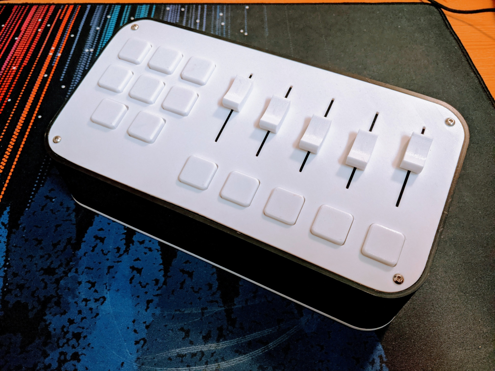
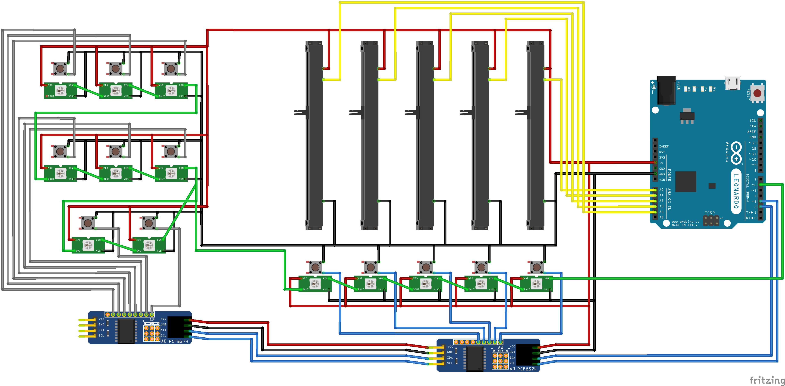

# Arduino-Midi-Control-Panel

The arduino code in the repository is designed to be used with the midi controller enclosure found [here](https://www.thingiverse.com/thing:5269219). The controller has 5 faders each with a mute button and an RGB LED, as well as 8 additional buttons with their own RGB LEDs. 

## Schematics
